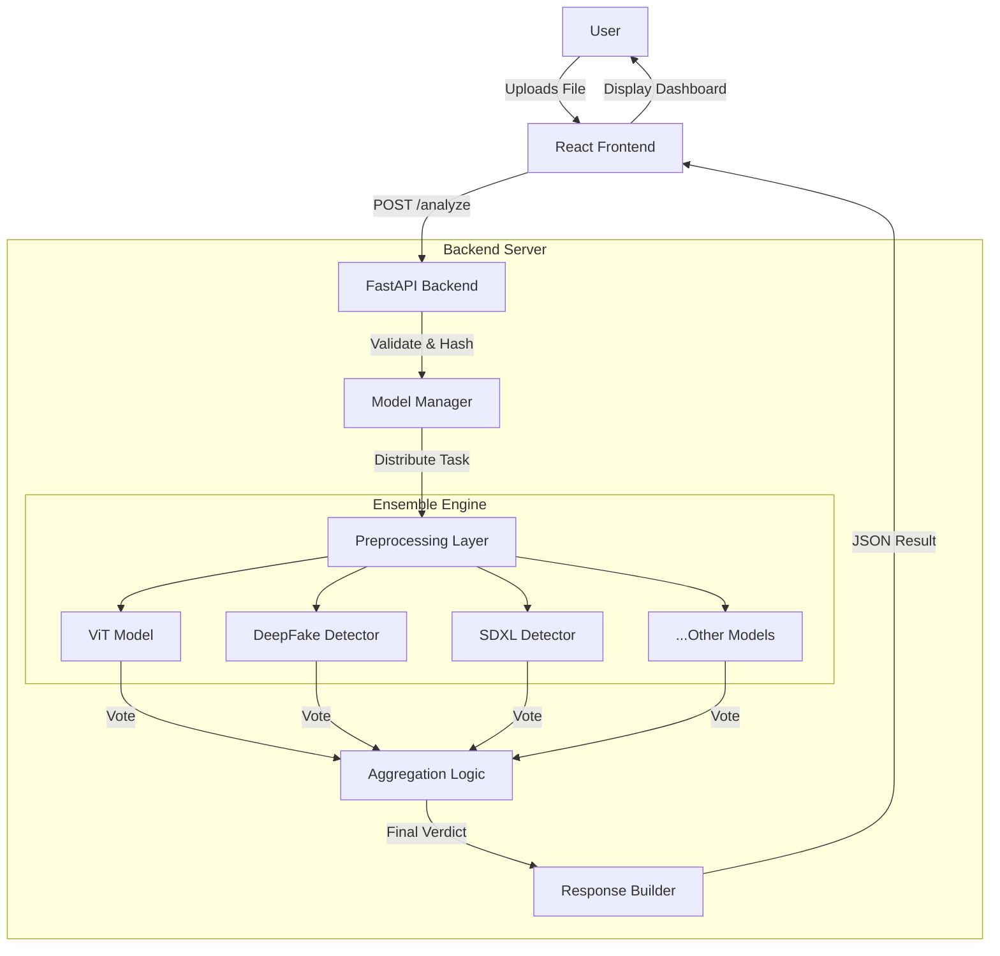

# CHAPTER 3: SYSTEM ANALYSIS

## 3.1 Feasibility Study
Before detailed design, a feasibility study was conducted to determine the viability of the "Advanced AI Content Detection System".

### 3.1.1 Technical Feasibility
The project creates a web-based ensemble detector. The technical requirements include high-performance libraries (PyTorch, Transformers) and a reactive frontend framework (React). Given the team's familiarity with Python and JavaScript, and the availability of open-source pre-trained models on Hugging Face, the project is technically feasible. The primary challenge is the computational load of running 11 models, which is managed via threaded execution and GPU acceleration.

### 3.1.2 Economic Feasibility
The project uses exclusively open-source software (OSS).
-   **Languages**: Python, JavaScript (Free)
-   **Frameworks**: FastAPI, React (MIT License)
-   **Models**: Hugging Face (Apache 2.0 / Open RAIL-M)
There is no licensing cost. The only potential cost is hardware (GPU) for deployment, which is available in the development environment. Thus, the project is economically viable.

### 3.1.3 Operational Feasibility
The system is designed with user experience in mind. The "Upload and Analyze" workflow is intuitive and requires no technical training, ensuring high operational acceptance among the target audience (general internet users, moderators).

## 3.2 Software Requirements
-   **Operating System**: Windows 10/11 or Linux (Ubuntu 20.04+)
-   **Programming Languages**: 
    -   Python 3.10+ (Backend logic)
    -   JavaScript/ES6 (Frontend logic)
-   **Frameworks & Libraries**:
    -   **Backend**: FastAPI, Uvicorn, PyTorch, Transformers, Pillow, NumPy, Scikit-learn.
    -   **Frontend**: React 18+, Vite, Tailwind CSS, Lucide React, Axios.
-   **IDE**: VS Code or PyCharm.
-   **Version Control**: Git & GitHub.

## 3.3 Hardware Requirements
-   **Processor**: Intel Core i5/i7 (10th Gen+) or AMD Ryzen 5/7.
-   **RAM**: Minimum 16GB (Recommended 32GB for simultaneous model loading).
-   **Graphics Card (GPU)**: NVIDIA RTX 3060 or higher (6GB+ VRAM) for CUDA acceleration.
-   **Storage**: 512GB SSD (Models occupy ~5-10GB).

## 3.4 Functional Requirements
1.  **File Upload**: System must accept image (JPG, PNG) and video (MP4) inputs.
2.  **File Validation**: System must reject unsupported formats and large files (>50MB) to prevent DoS.
3.  **Analysis Orchestration**: The backend must trigger all enabled models concurrently.
4.  **Consensus Calculation**: The system must calculate a final verdict based on >50% vote threshold.
5.  **Reporting**: Failure of one model should not crash the entire system (Graceful Degradation).

---

# CHAPTER 4: SYSTEM DESIGN

## 4.1 System Architecture
The system follows a **Decoupled Client-Server Architecture**. The frontend acts as a presentation layer, while the backend focuses purely on reliable inference.

### 4.1.1 High-Level Architecture Diagram


## 4.2 Data Flow Design
The data flow within the application ensures integrity and determinism.

### 4.2.1 Sequence Diagram: Analysis Process
```mermaid
sequenceDiagram
    participant U as User
    participant F as Frontend (React)
    participant A as API (FastAPI)
    participant M as Model Manager
    participant E as Ensemble Models

    U->>F: Drag & Drop File
    F->>F: Validate Type/Size
    F->>A: POST /analyze (FormData)
    activates A
    A->>A: Calculate MD5 Hash
    A->>M: predict(image)
    activates M
    M->>E: Batch Inference
    activates E
    E-->>M: Return Logits/Labels
    deactivates E
    M->>M: Calculate Consensus & Confidence
    M->>M: Generate Forensic Metrics (Seeded)
    M-->>A: Analysis Result Object
    deactivates M
    A-->>F: JSON Response
    deactivates A
    F->>U: Render Results Page
```

## 4.3 Module Description

### 4.3.1 Frontend Module
-   **`Dropper.jsx`**: Handles file input, drag-and-drop events, and initial file preview generation. Uses the `useDropzone` hook.
-   **`AnalysisLoader.jsx`**: Provides visual feedback during the asynchronous analysis phase. Displays a progress bar and rotating "scanning" messages to keep the user engaged.
-   **`Result.jsx`**: The core display component. It parses the JSON response and renders the Global Verdict card, the Model Consensus chart, and the detailed breakdown list.

### 4.3.2 Backend Module
-   **`main.py`**: The entry point. Handles CORS configuration, route definition (`/analyze`), and exception handling. It serves as the gateway to the logic.
-   **`model_manager.py`**: The "brain" of the system.
    -   **`load_models()`**: Initializes pipelines for all 11 models on startup to reduce latency per request.
    -   **`predict(image)`**: Coordinates the inference. It iterates through the loaded models, collates their outputs, and applies the voting logic.
    -   **`_calculate_forensics()`**: A helper method that generates consistent (deterministic) values for forensic visualization based on the file's hash and the global confidence score.

## 4.4 detailed UX/UI Design
The User Interface is designed according to **"Glassmorphism"** principles, utilizing semi-transparent backgrounds with background blur filters to create a modern, high-tech aesthetic suitable for an AI tool.
-   **Color Palette**: 
    -   *Primary*: Cyan/Teal (representing technology/verification).
    -   *Alert*: Red (for "Fake" verdicts).
    -   *Success*: Green (for "Real" verdicts).
    -   *Background*: Deep Gray/Black (Dark Mode default).
-   **Typography**: Inter (Google Fonts) for clean readability.
